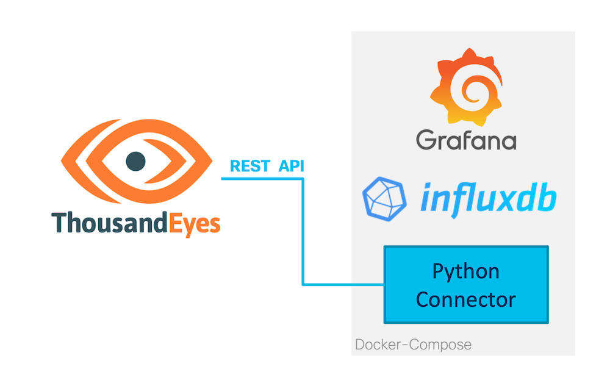

# ThousandEyes Grafana Dashboard

Extract data from ThousandEyes REST API and visualize it on your customized Grafana Dashboard. Deploy Grafana, InfluxDBv2 and the Python connector script within a few minutes.



**Supported Functions**

* Get **historic data** (custom time range) and **pull new data** (set your own interval) from your ThousandEyes tests.
* Grafana, a sample Dashboard and InfluxDBv2 are already pre-configured
* Currently Supported Tests:
	* (Web) Page load
	* (Web) HTTP server
	* (Network) End-to-End metrics
	* (Network) Path visualization

**Screenshots**


## Installation & Configuration

### Prerequisites

* git, Docker/Docker-compose installed

### Installation Steps

1. Clone repository

```
git clone https://github.com/flopach/thousandeyes-grafana-dashboard.git
```

2. Configure your environment and insert your credentials into the **docker/py_connector/config.py** file.

3. Start all containers _from_ the docker directory. This may take some minutes.

```
docker-compose up
```

More useful commands:

* Run as daemon mode: `docker-compose up -d`
* Stops containers: `docker-compose down`
* Build again the containers (when you changed the Python scripts): `docker-compose build`

### Configure: config.py
Simply open `docker/py_connector/config.py` in any text-editor to set your desired configuration.

* OAuth Bearer Token **(required)**
* Test types to add to dashboard
* time window
* pull interval
* enabling specific dataset (for demo or specific ThousandEyes testIds)

Example: When you've created a ThousandEyes page-load test (see below), you will receive data from 4 views:


### Configure: Dashboards

Login to Grafana dashboard and configure your dashboard modules by inserting the ThousandEyes testId. Additionally, use the query editor from the InfluxDB UI as a help to create and copy the Flux language syntax snippet.

Login **Grafana** - [http://localhost:3000](http://localhost:3000)

* username: admin
* password: admin123

Login **InfluxDB** - [http://localhost:8086](http://localhost:3000)

* username: admin
* password: admin123

### Configure: docker-compose.yml (optional)
If you are not familiar with Docker compose, go ahead to check the [documentation](https://docs.docker.com/compose/). Basically, 4 containers will be spun up:

* InfluxDBv2: data will be stored outside of the container
* InfluxDBv2 CLI setup instance: Will setup the other InfluxDBv2 container if it is not setup yet
* Grafana Dashboard: configuration settings will be stored outside of the container
* Py connector: Python connector scripts (stored in the `py_connector` folder)

## Versioning

**1.0** (Sep 2021) - Initial version

## License

This project is licensed under the Cisco Samplel Code License 1.1 - see the [LICENSE.md](LICENSE.md) file for details

## Further Links

* [Cisco DevNet Website](https://developer.cisco.com)